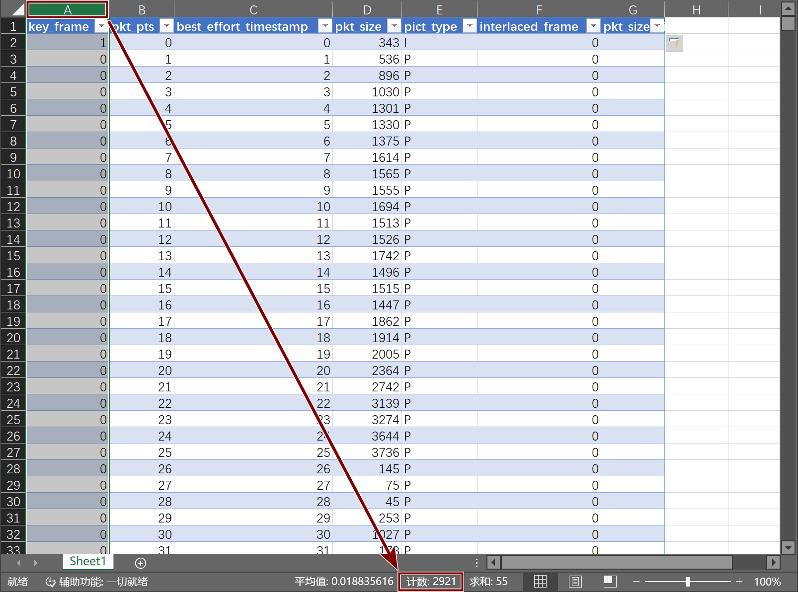

**本教程是[ffprobe教程](https://nazorip.site/archives/169/)的延伸。建议先阅读本体哦~**

本教程解决绘制码率曲线变化的问题，但限制条件是禁止使用Python环境与模块，VBS命令，宏，批处理，ps1，shell，MSSQL，网页工具等等需要配置环境的数据处理方法来降低门槛。如果有条件则完全可以用它们来得到同样的结果。

-----

下载ffprobe
-----

 - [gyan.dev](https://www.gyan.dev/ffmpeg/builds/#release-builds)
 - [btbn(GitHub)](https://github.com/BtbN/FFmpeg-Builds/releases)

 1. 解压出ffprobe.exe，记住解压路径

读取视频并输出xml
-----

    "X:\文件夹\ffprobe.exe" -i "X:\文件夹\视频.mp4" -select_streams v:0 -v error -hide_banner -show_frames -show_entries frame=pkt_pts,best_effort_timestamp,pkt_size,pict_type,key_frame,interlaced_frame -of xml > "X:\文件夹\1.xml"

**-select_streams**`<a:#/v:#>`用v:0指定用第一条视频流，且不使用音频。因为不同流的信息混在一起没法做可视化

**-v error**除非报错否则不输出额外信息

**-show_frames**显示所有帧信息，以实现码率变化可视化

**-show_entries frame=pkt_pts,best_effort_timestamp,pkt_size,pict_type,key_frame,interlaced_frame**限制show_frames中的信息到以上六列

**-of xml**输出xml格式文档，因为Excel支持。csv也行但是缺了标题，只剩下数据；Excel不原生支持ini和json，需要第三方工具转换

**×-pretty**该选项会加上码率单位，导致Excel看不懂

导入Excel
-----

1. 打开Excel，不用建立新工作簿，直接将xml拖入其中
2. 选择"作为只读xml表"，点确定
3. 不用管"指定的xml源没有引用架构..."提示，点确定，表格结果如图
4. 由于ffprobe用字节byte作计量单位，而bit才是常用剂量码率的单位，所以需要新建一列做转换

-----

byte转bit
-----

 1. 单击G1格（列G行1，或列7行1）
 2. 在顶部编辑栏写`pkt_size_bit`，点击左边的"√"或按Enter
   - *注意：如果不点击左边的"√"或按Enter，则Excel会持续选中格子*

 3. 此时自动更正会套用标题
   - 如果格式没有变化则去文件-->选项-->校对-->自动更正-->键入时自动套用格式-->工作时应用: "□在表中包含新行和列"，然后重来

 4. 单击除pkt_size_bit外的任意标题（key_frame，pkt_pts等），在右下角可以看到"计数: xxxx"，这个数就是*当前表格高度*，即视频的总帧数

 5. 单击G2格（列G行2，列7行2 或标题下面）
 6. 在顶部编辑栏写`=PRODUCT(D2*8)`，点击左边的"√"或按Enter

   - 如果整列数据没有变化则去文件-->选项-->校对-->自动更正-->键入时自动套用格式-->工作时应用: "□将公式填充到表以创建计算列"，然后重来
   - 如果仍没有变化则去文件-->选项-->高级-->编辑选项打开"为单元格值启用自动完成"以及其子项，然后重来

-----

变化线
-----

 1. 单击best_effort_timestamp（如果没有数据则pkt_pts）上的标号以选中整列
 2. 按住Ctrl并单击刚刚创建的pkt_size_bit上的标号以同时选中该列

 3. 在Excel顶栏上选插入-->图表栏-->折线图-->二维面积图，就得到精确的码率变化图表了

   - 由于非常精确，所以要放大，拉长才能看清很细的线
 4. 单击图中面积阴影部分以选中，此时图表会显示全部顶点；
   - 光标放在顶点上，Excel显示"绘图区"时微移光标一下（仍然保持在顶点上），就会得到对应点的编号
   - 一般情况下，这些尖峰顶点是I帧，但也可能是大部分为I块的P帧

趋势线
-----

 1. 单击面积阴影部分以选中，右键-->添加趋势线
 2. 默认会出现线性趋势线，根据需要的分析方法选择需要的趋势线：

   - **线性**：单纯分析码率增长速度
   - **指数**：对码率增长敏感时，看指数线曲度是否足够直
   - **对数**：log，对增长不敏感，但初始变化敏感的分析
   - **多项式**，阶数6：分析哪部分视频占平均码率更大（阶数最大竟然只有6，切）

   - **移动平均**，周期10：额外添加一条更平均的码率变化曲线

帧类型饼图
-----

 1. 分别在H1（列H行1，或列8行1），I1，J1，K1，L1填写以下标题
   - `count_I`，`count_P`，`count_B`，`count_IDR`，`count_non_IDR`
 2. 和开始添加`pkt_size_bit`一样，Excel应该会自动套用格式

 3. 选中count_I标题下格，编辑栏中填写`=COUNTIF(E2:E99999,"I")`，点击左边的"√"或按Enter
   - 其中的E代表pict_type列，99999代表取决于帧数量的表格高度，超过99999则填写实际高度
   - 忽略这些自动填充导致第二行往下出现的新值

   - 实际表格高度通过选中有数据的表格列（此处为A,B,C,D,E,F）而在右下角"计数：xxxx"+1得到
 4. 选中count_P标题下格，编辑栏中填写`=COUNTIF(E2:E99999,"P")`
 5. 选中count_B标题下格，编辑栏中填写`=COUNTIF(E2:E99999,"B")`
 6. 选中count_IDR标题下格，编辑栏中填写`=COUNTIFS(E2:E99999,"I",A2:A99999,"1")`
   - 其中的A代表key_frame列，如果不是则需要修改到匹配列的字母
   - COUNTIFS支持多个判断条件
 7. 选中count_non_IDR标题下格，编辑栏中填写`=COUNTIFS(E2:E99999,"I",A2:A99999,"0")`

   - 为保证COUNTIFS不算错，需要与count_non_IDR求和，应当等于count_I

 8. 拖拽选中I1到L2（count_P，count_B，count_IDR，count_non_IDR以及下方对应格子的值，共2x4个项）
 9. 在Excel顶栏上选插入-->饼图-->更多饼图-->子母饼图-->第二个推荐项目，帧类型的饼图就做好了
   - 考虑到会出现千分之一比值的帧类型，所以为了避免看不到，只能选子母饼图

   - 选一个漂亮的样式吧

这玩意做了才知道有多难，那么就这样<(。_。)>

::转载要求: *在本文下方写上"转载+冒号+转载地址"，或者下方发个评论*... 但是真的会有人转载这玩意儿吗？

## 打赏信息
求个打赏，支持一下吧T_T

